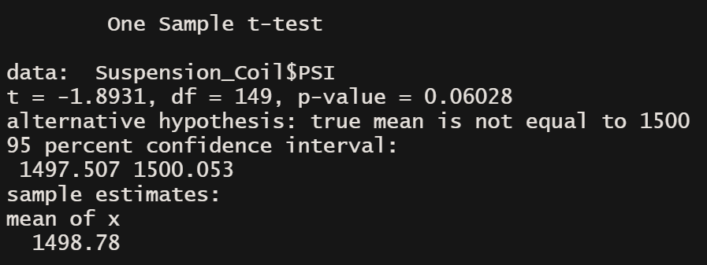
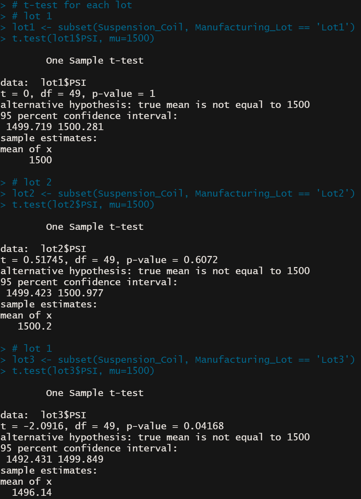

# MechaCar_Statistical_Analysis

## Linear Regression to Predict MPG

**Which variables/coefficients provided a non-random amount of variance to the mpg values in the dataset?**

The vehicle length and ground clearance are more likely to produce a non-random amount of variance to the mpg. 

**Is the slope of the linear model considered to be zero? Why or why not?**

As the p-value for the model is 5.35e-11 we have enough evidence to reject out null hypothesis and say that the slope of the linear model is not 0.

**Does this linear model predict mpg of MechaCar prototypes effectively? Why or why not?**

The r-squared value of this model is .7149 which tells us that approximately 71.5% of all predictions given these inputs will correctly be determined by this model. So yes we can effectively predict the mpg. 

## Summary Statistics on Suspension Coils

**The design specifications for the MechaCar suspension coils dictate that the variance of the suspension coils must not exceed 100 pounds per square inch. Does the current manufacturing data meet this design specification for all manufacturing lots in total and each lot individually? Why or why not?**

We can see that for Lots 1 and 2 the variance is well within the 100 PSI range but for lot 3 it exceeds. When we look at the overall variance we can see that it would show that the manufacturing is all within specification, when in actuality lot 3 is creating a heavy skew.

## T-Tests on Suspension Coils

This t-test shows us that something went wrong in lot 3 as the p-value is quite low, below the threshold that we could consider within a reasonable range. 

## Study Design: MechaCar vs Competition

A solid statistical study that could be done to compare the MechaCar to competitors would be an ANOVA test, as it would compare the variance of means of multiple fields that would be studied. Some fields could include cost, fuel efficiency both highway and city, power and torque figures, maintenance costs and safety rating. Our hypothesis would be something along the lines of: if the p-value of our ANOVA test is greater than .1 MechaCar performs on par to its competitors.  We would be able to also create a linear regression function to see something like price in comparison to specific performance metrics to compare the MechaCar to its competitors. 
